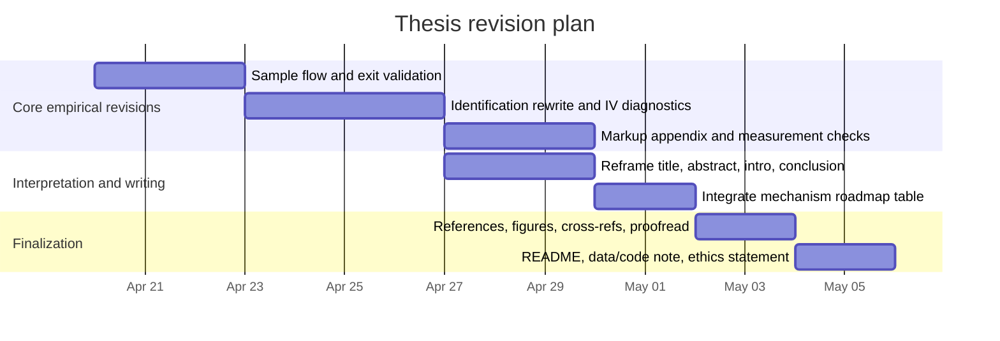

# Referee Memo on Discipline Without Creative Destruction

## Executive summary

This is a strong, ambitious, and potentially distinction-level thesis on how import competition from entity["country","China","nation state"] affects markup dynamics in manufacturing in entity["country","Turkey","nation state"]. Its main strengths are a clear and relevant research question, a thoughtful theoretical framework, an unusually rich empirical architecture for a master’s thesis, and a genuinely interesting attempt to separate output-competition from input-supply channels while also distinguishing within-firm adjustment from reallocation and selection. The draft’s central empirical finding is credible in a narrowed form: higher Chinese import penetration appears to reduce markup growth among surviving incumbent firms, with stronger effects in the upper tail of the markup-adjustment distribution and in more concentrated sectors. However, I would not treat the thesis as final yet. The main reasons are that the identification strategy and its scope are not explained with sufficient rigor, the extensive-margin interpretation is too strong given likely database attrition and unclear exit validation, the markup-measurement appendix remains under-specified relative to the importance of the result, some robustness exercises materially weaken the broadest claims, and the manuscript still contains visible placeholders and reproducibility gaps. My recommendation is **major revision before final submission**. fileciteturn0file0

## Overall assessment

The thesis makes a meaningful contribution primarily through **setting and synthesis**, not through a wholly new estimator. Relative to recent work that separates output and input channels of the China shock, its originality lies in applying that logic to firm-level markup dynamics in an emerging economy, adding grouped IV quantile evidence, and linking firm responses to sectoral decomposition. The research question is clear, the hypotheses in the theory section are explicit, and the grouped IV quantile design is well matched to a treatment that varies at the sector-year level. At the same time, the literature review is not yet fully complete on the econometric side: it cites the modern shift-share framework, but it should also engage more directly with the literature on Bartik-share identification and shift-share inference. fileciteturn0file0 citeturn1search3turn1search9turn0search0turn0search1turn0search10

| Major issue | Severity | Why it matters | Suggested fix |
|---|---|---|---|
| Shift-share identification and inference | High | The headline estimate appears to rely on concentrated identifying variation from a small set of influential sectors | Add a dedicated assumptions subsection, cell-level first stage, Rotemberg-weight discussion in the main text, and weak-IV-robust inference |
| Measurement of exit, entry, and “creative destruction” | High | Panel disappearance in a proprietary firm database is not the same as true firm death | Validate exit against official business-demography sources or relabel results as sample attrition/turnover |
| Markup construction and sample transparency | High | The baseline estimator, effective sample window, and treatment-cell structure are not documented clearly enough | Add a sample flowchart, baseline-estimator paragraph, elasticity diagnostics, and clearer appendix documentation |
| Interpretation of mechanisms and policy claims | Medium-High | Some mechanism evidence is mixed, and the total sector-level effect is insignificant | Narrow the main claim to incumbent firm-level discipline and soften the antitrust-substitutability conclusion |
| Reproducibility and final polish | High | The draft still contains placeholders, unresolved references, and no replication statement | Clean all cross-references, add code/data statement, ethics/licensing note, and a compact replication appendix |

## Major critiques

1. **Identification is the main substantive issue still standing between this draft and a convincing final thesis.** The thesis correctly uses a shift-share design to instrument sectoral import penetration, but the exposition needs to be much more disciplined about what exactly must be exogenous and what variation is doing the work. As written, the empirical sections move quickly from “classic shift-share IV” to causal interpretation, while the first-stage table is reported at the firm-year level even though the treatment varies at the sector-year level, and the relevant sector-level sample is much smaller. More importantly, the appendix shows that once sectors with the largest Rotemberg weights are excluded, the first stage weakens sharply and the second-stage coefficient becomes unstable. That does not invalidate the paper, but it does mean the estimate should be presented as **local to influential exposure cells**, not as broad evidence for all manufacturing sectors. Standard references are clear that shift-share validity can depend on how one interprets the roles of shocks and shares, and that inference can be distorted when observations share similar exposure structures. fileciteturn0file0 citeturn0search0turn0search1turn0search10

   **Suggested revision.** Add a short subsection titled something like “Identification assumptions and effective variation.” In it, do four things explicitly: define the treatment cell as sector-year; justify the use of 2009 exposure shares; report the number of effective sector-year observations alongside the firm-year count; and move the Rotemberg-weight discussion from a passing robustness note into the main text. I would also strongly recommend reporting a cell-level first stage, weak-IV-robust confidence intervals, and one additional robustness exercise that is easy to understand substantively, such as a pre-2020 specification or a leave-one-destination-market exercise. A good model sentence for the introduction would be: *“The identifying variation comes from differences in baseline sectoral exposure to common changes in Chinese export performance in other high-income markets; accordingly, the estimates should be interpreted as local to more highly exposed Turkish manufacturing sectors.”* fileciteturn0file0

2. **The thesis currently over-interprets entry, exit, and “creative destruction.”** This is the second most important issue. The paper itself notes possible post-2016 attrition from the firm database and adds a labor-share-by-post-2016 control partly to address that concern. Yet the title and conclusion still lean heavily on a “discipline without creative destruction” framing, and the sector decomposition treats firms appearing and disappearing in the panel as entry and exit. Unless the database status is validated against an official business registry or business-demography series, those margins should be interpreted much more cautiously. In this setting, disappearance may reflect nonreporting, coverage changes, or irregular filing rather than true market exit. The same concern applies to the selection-correction exercise: it is sensible to worry about endogenous survival, but the manuscript should distinguish more clearly between **economic exit** and **sample attrition**. fileciteturn0file0

   **Suggested revision.** Provide a one-page sample-construction and panel-flow appendix. Start with the raw 2009–2023 firm panel, then show exactly how the estimation sample shrinks to the main markup sample and to the sector-year design sample. Define “exit” operationally. If true exit cannot be validated before submission, then change the language throughout from “exit” to “sample disappearance” or “observed exit,” and revise the title/abstract to avoid implying a full test of creative destruction. The safest version of the contribution is: *the paper studies incumbent discipline and observed sample turnover in a proprietary firm panel*, not creative destruction in the Schumpeterian sense. That would make the thesis more honest and therefore more persuasive. fileciteturn0file0

3. **Markup measurement is central to the thesis, but the documentation is not yet good enough for a near-final draft.** The main text says the paper follows the Hall–De Loecker–Warzynski production approach using COGS as the flexible input, and the appendix later presents both Cobb-Douglas and translog variants. But the reader still does not learn clearly which specification is the baseline, how the elasticities are estimated in practice, whether estimation is within sector or pooled with interactions, how domestic sales are constructed for exporters, or how sensitive the final result is to those implementation choices. This matters because the production-based markup estimator requires cost minimization and at least one genuinely variable input, and the newer markup literature emphasizes that financial-statement-based measures can be informative for trends and dispersion while still carrying nontrivial measurement bias. The thesis already moves in the right direction by focusing on changes rather than levels, but it needs to explain this much more explicitly and much earlier. fileciteturn0file0 citeturn1search2turn0search7

   There is also a temporal-structure issue that needs attention. The draft combines firm data running through 2023 with an input-linkage construction that uses a 2003 Turkish input-output table and the WIOD release whose standard coverage ends in 2014. That may be perfectly defensible if treated as a fixed, predetermined exposure matrix, but right now the choice looks ad hoc rather than motivated. The same is true of the Kirov-style robustness: the appendix honestly notes substantial sample loss and imprecision, which is good, but the main text still overstates the degree to which this exercise “confirms” the baseline. fileciteturn0file0 citeturn2search21turn0search7

   **Suggested revision.** Add a compact appendix table with: the baseline markup estimator actually used; the estimated flexible-input elasticity distribution; the correlation between baseline and alternative markup measures; and the sample count at each step. Then revise the main text to say something like: *“Because markup levels from accounting data are sensitive to production-function and pricing assumptions, I focus on within-firm changes and treat level results as supportive rather than decisive.”* Also justify the frozen I-O weights explicitly and, if feasible, add one sensitivity check using an alternative frozen base year or a shorter estimation period. fileciteturn0file0

4. **The results are interesting, but the theory-to-evidence mapping needs to be tightened and some claims toned down.** The thesis does many things well here: the hypotheses are explicit, the quantile evidence is genuinely informative, and the result that upper-tail markup adjustments compress more in concentrated sectors is one of the strongest parts of the manuscript. But the paper too often says that the results are “aligned” with the theoretical framework without confronting the places where the evidence is only partial. The total sector-level effect is statistically weak; Table 8 does not show reallocation toward large incumbents under output competition; and the interaction with lagged markup suggests marginal effects become less negative at higher initial markup levels, which is not the cleanest possible confirmation of a “high-markup firms are hit most” story. In other words, the paper needs to separate three distinct ideas that currently blur together: firms with high **initial markups**, firms with high **market shares**, and firms in the upper tail of **markup changes**. Those are not the same objects. fileciteturn0file0

   **Suggested revision.** Add a roadmap table that maps each prediction to its relevant empirical test and labels the support as “strong,” “partial,” or “not supported.” Then rewrite the introduction and conclusion so that the central claim becomes narrower and fully defensible: *Chinese output competition disciplines surviving incumbents’ markup growth, especially in the upper tail and in concentrated sectors; sector-wide effects are weaker because reallocation partly offsets within-firm discipline.* I would also soften the statement that trade liberalization and antitrust are “partial substitutes.” That policy claim is suggestive, but the evidence here is reduced-form, country-specific, and much stronger on incumbent pricing than on aggregate market-power control. fileciteturn0file0 citeturn1search3

5. **The manuscript is not yet submission-ready as a document.** The draft still contains visible placeholders and workflow notes, including “need to be added,” “Table ??,” “Figure ??,” “I would use” in the appendix, and “Wild bootstrap was not available in the current run environment.” Several table notes remain incomplete; at least one table leaves the KP row blank; some appendix tables lack fully interpretable column definitions; and the bibliography contains encoding issues. There is also no code/data availability statement, no replication roadmap, and no short ethics/licensing note explaining what can and cannot be shared given the proprietary firm database. For a near-final thesis, these are not small cosmetic matters; they affect credibility and assessability. fileciteturn0file0

   **Suggested revision.** Before final submission, the paper needs a complete scholarly apparatus: resolved cross-references; self-contained captions; a data appendix that cites the official dataset documentation; a README describing concordances, cleaning, variable construction, and estimation order; and a short note on confidentiality, licensing, and replication constraints. Official documentation exists for the BACI trade data, the WIOD release, the UNIDO statistics portal, and the company-data product used in the analysis, and those should be cited directly in the bibliography rather than left implicit. fileciteturn0file0 citeturn2search0turn2search1turn2search2turn2search7

## Minor and technical edits

The draft also needs a final round of concentrated section-level edits. fileciteturn0file0

- **Abstract and introduction.** State the empirical estimand in one sentence near the start: effect of instrumented sectoral Chinese import penetration on firm-level markup growth among observed incumbents. The current opening is strong but too compressed.
- **Literature review.** Add one paragraph on shift-share identification and inference, with explicit discussion of exposure-share exogeneity, influential shares, and inference under correlated exposure structures. citeturn0search0turn0search1turn0search10
- **Data section.** Clarify the estimation window as distinct from the raw data window. “Nominator” should be “numerator,” and the sample-cleaning paragraph should specify exactly how firms with intermittent reporting are handled.
- **Empirical strategy.** Define \(t_0\) numerically the first time it appears. Page 18 currently says the share is the 2009 exposure share, but the notation is left abstract too long.
- **Selection section.** Be explicit that lagged EBIT margin is a proxy, not a validated sufficient statistic. Explain why third-order polynomial is chosen.
- **Results section.** Replace blanket wording like “all results are aligned” or “robust to a number of robustness checks” with result-by-result language.
- **Tables and figures.** Explain the “comparison specification” in Table 5; fill the blank KP/F-stat area in Table 8; define the sample restrictions behind each column of Table 18; and make every figure caption readable without returning to the text.
- **Appendix.** Change future or hypothetical phrasing into past tense. “I would use a Cobb-Douglas baseline” should become a precise statement of what was actually implemented.
- **References.** Fix encoding problems such as corrupted accented characters.
- **Conclusion.** Replace broad wording about controlling “the rise of market power” with the narrower and better-supported claim about markup growth among surviving incumbents.

## Final submission checklist

Before I would sign off on the thesis as final, I would want the following completed:

- A one-page sample flowchart from raw data to final estimation sample.
- A clear operational definition and, if possible, validation of exit and entry.
- A revised identification subsection discussing effective treatment cells, influential sectors, and weak-IV-robust inference.
- A markup-measurement appendix that states the baseline implementation unambiguously.
- A rewritten introduction and conclusion that align exactly with what the tables actually show.
- All placeholders, broken cross-references, incomplete notes, and missing figure/table labels removed.
- A short code/data statement explaining what is replicable, what is restricted, and where the scripts or README are archived.
- A brief ethics/licensing note covering use of proprietary firm data and confidentiality constraints.

## Revision timeline

